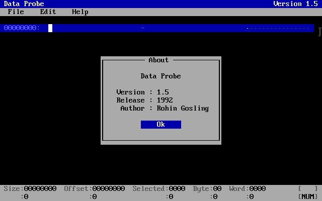

# Data Probe — HEX Editor for MS-DOS
> *Version 1.5*


<p align="center">
  
</p>


## 📑 Table of Contents

- [✨ Features](#-features)
- [🚀 Quickstart](#-quickstart)
- [🔨 Build](#-build)
- [📂 Repository Structure](#-repository-structure)
- [⚙ Technical Details](#-technical-details)
- [📄 License](#-license)

<br>

## ✨ Features

Data Probe is a light weight HEX editor for DOS that runs on any x86 machine. Data Probe was written in the 1990's but still serves as a useful tool for any retro computing environment in use today.

- Insert and overwrite editing, selection blocks, and delete/backspace operations that track logical file length.
- Chunked paging engine: edit files larger than available memory via a sliding chunk window sized from free far memory.
- CUA / Turbo C++ IDE clipboard — `Copy = Ctrl+Ins`, `Cut = Shift+Del`, `Paste = Shift+Ins` (mode-aware paste: inserts in insert mode, overwrites in overwrite mode).
- Find / Replace across the whole file — search plain strings or byte-pair sequences, paging chunks in and out as needed.
- Export to text and printing, either the whole file or the current selection only.
- Live dual status bars (hex and decimal): size, offset, selected, byte, and word — with configurable little-/big-endian word order.
- Relative-position margin marking top-of-file, bottom-of-file, chunk boundaries, and the cursor's scaled file position.
- Runtime settings (rows, address radix, hex divider, position margin, buffer size, insert default, word byte-order, About-dialog-at-launch) that persist to a hand-editable `CONFIG.INI`.

<br>

## 🚀 Quickstart

A ready-to-run `DPROBE.EXE` is attached to the [GitHub release](https://github.com/rohingosling/data-probe/releases). Download the latest `DPROBE.EXE` and drop it anywhere on your MS-DOS machine or in a folder you can reach from DOSBox. The executable is fully self-contained; on first run it writes a `CONFIG.INI` next to itself for your saved settings, so nothing else needs to be installed.

Data Probe takes no command-line arguments — you load files from inside the program. Start it, press <kbd>F10</kbd> to drop the menu bar, and choose **File → Open…** to browse to a file. Press <kbd>F10</kbd> again (or <kbd>Esc</kbd>) at any time for the menus, and open **Help → User Guide** for the full key map.

### Run on a real MS-DOS PC

Copy `DPROBE.EXE` onto the machine — for example into `C:\TOOLS` — then run it from that directory:

```dos
C:\TOOLS> DPROBE
```

Data Probe needs MS-DOS 3.30 or later and an 80286 or better CPU (it will run on any 386/486 and beyond). That is the only requirement; there is no installer and no runtime to set up.

### Run in DOSBox

If you are on a modern PC, [DOSBox](https://www.dosbox.com/) gives you the same experience. Put `DPROBE.EXE` in a folder on your host — say `C:\DOS\TOOLS` on Windows — then start DOSBox, mount that folder as a DOS drive, and run it:

```dos
Z:\> mount c C:\DOS\TOOLS
Z:\> c:
C:\> DPROBE
```

For a full-screen, sharper display, press <kbd>Alt</kbd>+<kbd>Enter</kbd> to toggle DOSBox to full screen.

### Run Data Probe from anywhere (add it to the PATH)

To use Data Probe as a system-wide tool, launchable by typing `DPROBE` from any directory, put its folder on the DOS `PATH`.

**On an MS-DOS PC**, keep `DPROBE.EXE` in a dedicated tools directory such as `C:\TOOLS` and add that directory to the `PATH` line in `C:\AUTOEXEC.BAT`:

```dos
PATH=C:\DOS;C:\TOOLS
```

Reboot (or re-run `AUTOEXEC.BAT`) so the new `PATH` takes effect. After that, `DPROBE` works from any drive or directory.

**In DOSBox**, do the same thing from the `[autoexec]` section at the bottom of your `dosbox.conf` (or `dosbox-0.74-3.conf`), so the mount and `PATH` are set up automatically every time DOSBox starts:

```ini
[autoexec]
mount c C:\DOS\TOOLS
c:
set PATH=%PATH%;C:\TOOLS
```

With that in place, launching DOSBox drops you at a `C:\` prompt from which `DPROBE` runs no matter which directory you have changed into.

<br>

## 🔨 Build

Requires MS-DOS, or a DOS emulator like [DOSBox](https://www.dosbox.com/), with the Borland C++ 3.1 command-line driver (`bcc`) on the `PATH`. The scripts run inside an already-configured DOSBox session and are launched from the `build/` directory:

```bat
cd build
BUILD.BAT
```

`BUILD.BAT` compiles the four modules — MicroText (`mtext.c`, C with inline assembly), MicroApp (`mapp.cpp`, C++), the INI settings library (`ini.cpp`, C++), and DataProbe (`hexview.cpp`, `filebuf.cpp`, `dprobe.cpp`, C++), all with the large memory model (`-ml`), then links the six objects into `dprobe.exe`. The `.obj`, `.exe`, and `build.log` artifacts land in `build/`.

### Clean

Run `CLEAN.BAT` from the `build/` directory to remove build artifacts (`*.obj`, `*.exe`, `build.log`).

## 📂 Repository Structure

```
Data Probe/
├─ src/
│  ├─ M-TEXT/           MicroText — C + inline-asm text library
│  │  ├─ mtext.c
│  │  └─ mtext.h
│  │
│  ├─ M-APP/            MicroApp — C++ user interface class framework
│  │  ├─ mapp.cpp
│  │  └─ mapp.h
│  │
│  ├─ INI/              INI — C++ INI-file settings library
│  │  ├─ ini.cpp
│  │  └─ ini.h
│  │
│  └─ D-PROBE/          DataProbe — HEX editor application
│     ├─ dprobe.cpp
│     ├─ dprobe.h
│     ├─ hexview.cpp
│     ├─ hexview.h
│     ├─ filebuf.cpp
│     └─ filebuf.h
│
├─ build/               Build scripts (BUILD.BAT compiles + links DPROBE.EXE)
│  ├─ BUILD.BAT
│  └─ CLEAN.BAT
│
├─ test/                Per-module test drivers
├─ README.md
└─ LICENSE
```

## ⚙ Technical Details

- **Target OS:** MS-DOS 3.30, or above.
- **Target CPU:** 80286 / 80386 / 80486, real mode.
- **Memory model:** Large (`-ml`), far code + far data, with a `farmalloc`-ed file buffer.
- **Display:** Direct `0xB800` hardware text mode (80×25, or 43/50 rows), one word per cell (character + attribute).
- **Double buffering:** The UI composites into an off-screen `TEXTBUFFER`, then a single `FlipScreenBuffer` (`REP MOVSW`) blits it to `0xB800`, flicker-free.
- **Chunked paging:** A sliding chunk window, sized from free far memory (`farcoreleft`), lets Data Probe edit and search files larger than available RAM.
- **Toolchain:** Borland C++ 3.1 (`bcc`), with MicroText's `asm { }` blocks handled by the built-in inline assembler (no separate TASM pass).

### Dependency Diagram

Data Probe is dependant on three other projects.

- **INI** — An INI configuration file management library.
- **Microtext** — A low level text mode library written in C and inline x86 assembly language.
- **MicroApp** — A visual text mode application framework, that is itself dependant on **MicroText**.
- **Data Probe** — An MS-DOS HEX Editor (this application), that depends on **MicroApp** and **INI**.

<br>

```
  ┌───────────────────────────────────────┐
  │              Data Probe               │
  └──────┬────────────┬────────────┬──────┘
         │            │            │
         ▼            │            ▼
  ┌─────────────┐     │     ┌─────────────┐
  │  MicroApp   │     │     │     INI     │
  └──────┬──────┘     │     └─────────────┘
         │            │
         ▼            ▼
  ┌──────────────────────────┐
  │        MicroText         │
  └──────────────────────────┘
```

<br>

## 📄 License

Released under the [MIT License](LICENSE) — Copyright © 1992 Rohin Gosling.
